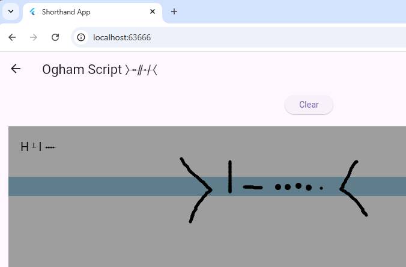

# Shorthand

Different approach on handwriting recognition. Under construction...  Don't expect much.

There is not that many alphabets in the world really...

There is __ from each continent at least one script recognized from time until medieval:
- America: Morse
- Europe: Ogham
- Africa:
- Asia: 
- Australia: 
- Polynesia: they don't have

---

## Discovered

Ciphers
- Morse
- Tomtom Code
- Ogham Script ᚛ᚑᚌᚐᚋ᚜
- Pigpen Script
- Braille

Phoenician alphabet
- Elder Furthak

Oracle bone script
- ...

Korean
- Hangul

Shorthands
- ...

More to come...

No documentation how to write yet so you have to unfortunately read code... :)

### Whiteboard/Chalkboard

- JustPaintPage: Think of this as whiteboard/chalkboard

## Roadmap

Maybe benchmark page, Notepad (clipboard feature?), Birdwatching...

## Platforms

Web for now. Available at site github pages. Using Github Actions to deploy from /main branch.

## License

MIT.
